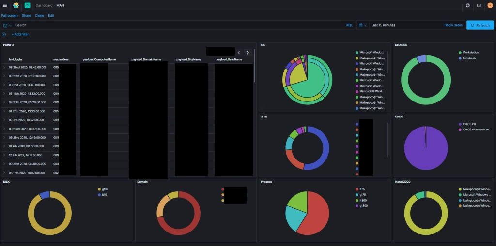

# pcinfo
This scripts collecting workstations information

## Description

Consists of three scripts

### PCInfo

Using wmi requests, it gets the necessary information about the workstation and writes it to a json file on a network folder

### PCadvInfo

The script looks into the folder with the files received by the agent, compares by content, removes duplicates, parses json files. Supplements them with information from AD and writes the final json with the necessary information to a folder with the name containing the current month.

### pcinfo2db

The script processes the resulting json files, compares them with the existing values in the database, and in case of changes, writes json to the database.
